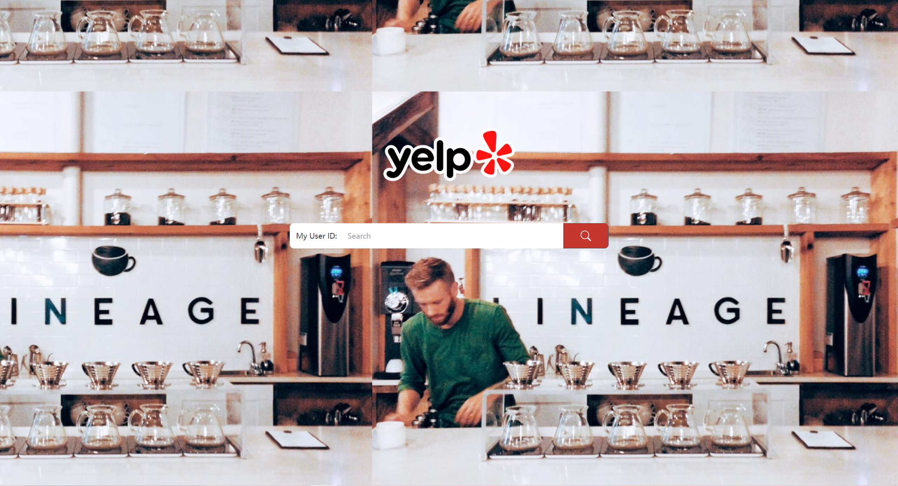

# Yelp-Recommender-System
Yelp Recommender System - Your Best Restaurant Finder
____________________________________________________________________________________
## Dependencies
Requires following packages for json_to_csv_converter.py (using python2):  
* csv
* simplejson

Requires following packages for other data processing codes:  
* numpy
* pandas
* surprise
* sklearn
* tqdm
* sqlalchemy

## Introduction

## Dataset

## Usage
### 1. json_to_csv_converter.py
Provided by Yelp, it is used for converting .json files to .csv files for subsequent processing. There was a little bug in it so I submit a correct version. 
Please note that this code should be runned in Python2.

### 2. business_preprocessing.py
Implement data clean on 'yelp_academic_dataset_business.csv'. It save the preprocessed data as 'business.csv'.

### 3. user_preprocessing.py
Implement data clean on 'yelp_academic_dataset_user.csv'. It save the preprocessed data as 'user.csv'.

### 4. review_preprocessing.py
Implement data clean on 'yelp_academic_dataset_review.csv'. It save the preprocessed data as 'review.csv'.

### 5. topics.py
Use topics given by LDA algorithm for each topic, we can get topics for every users and business. The data will be stored as 
'user_topics.csv' and 'business_topics.csv'.

### 6. categories.py
We can get categories for each business in 'business.csv', then we can aggregate them to get categories for users. The data will be stored as 
'user_topics.csv' and 'business_topics.csv'.

### 7. final_preprocessing.py
Compute category similarity and topic similarity between all users and businesses using cosine similarity. The data will be stored as 
'final_matrix.csv'.

### 8. train.py
Train the CF model and save it.

### 9. test.py
Test the pure CF method and our hybrid method, show metrics for both methods.

## Website
### 1. Frontend
We built Frontend by Vue.
### 2. Backend
We used Django to build backend. You should put business_categories.csv, business_topics.csv, user_categories.csv, user_topics.csv, 
and model.pickle in this folder to run the backend. All these files can be got from the codes we provided.
### 3. Demo
We desgined four pages in total.\
The first page is the main page, users can type their user id in the input box.

test
